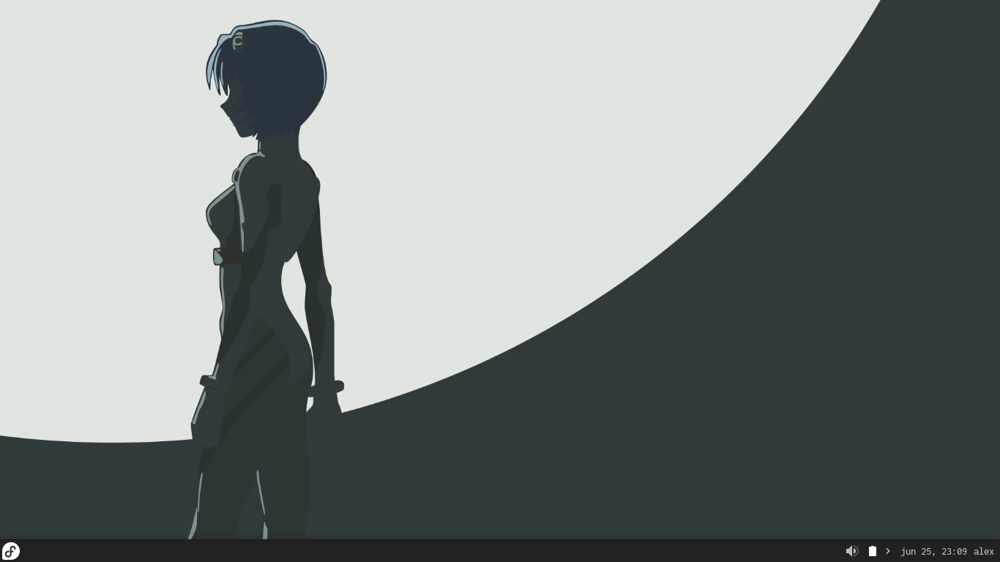
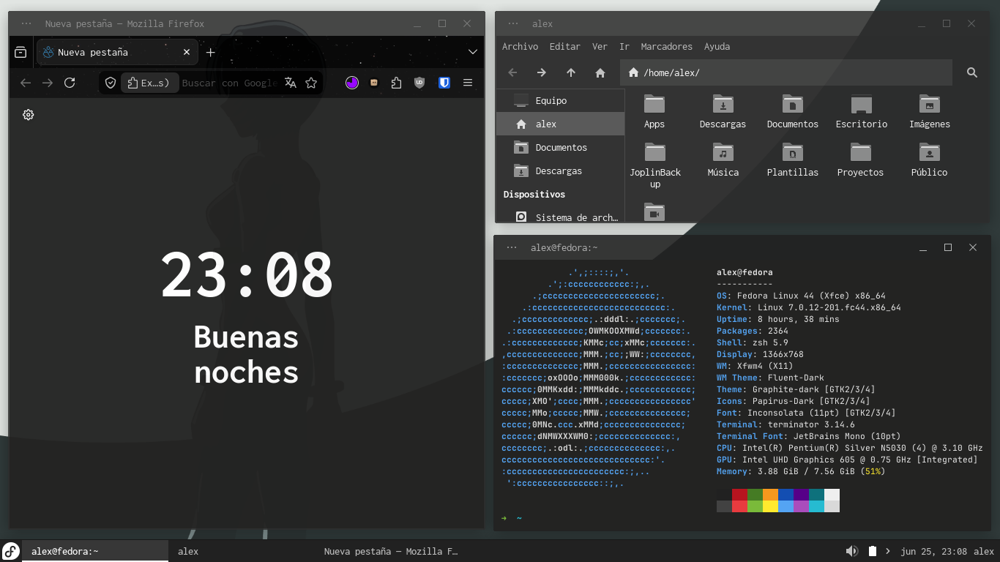

# Dotfiles y configuración para Fedora Linux
Este repositorio lo he hecho con el fin de compartir mis archivos para personalizar y configura mi sistema Fedora, también lo usare como un manual de como preparar y configurar mi entorno Fedora cuando haya cambiado de OS y quiera volver a utilizarlo.

## Contenido

* [1. Información del Sistema](#información-del-sistema)
* [2. Capturas](#capturas)
* [3. Dotfiles y archivos](#dotfiles-y-archivos)
* [4. Preparación inicial](#preparación-inicial)
* [5. Fuentes](#fuentes)
* [6. Tema](#tema)
* [7. Herramientas](#herramientas)
* [8. Atajos](#atajos)

## Información del Sistema

- **SO**: Fedora
- **Shell**: Zsh
- **ED**: [XFCE4](https://xfce.org/)
- **Panel**: XFCE-Panel
- **Fuente**: [Inconsolata](https://fonts.google.com/specimen/Inconsolata)
- **Fuente Monoespaciada**: JetBrains Mono
- **Editor de Texto:** Vim
- **IDE**: [Visual Studio Code](https://github.com/Microsoft/vscode)
- **Navegador**: [Firefox](https://github.com/mozilla)
- **Tema Gestor de ventanas**: [Fluent Dark](https://github.com/vinceliuice/Fluent-gtk-theme)
- **Tema GTK**: [Graphite](https://github.com/vinceliuice/Graphite-gtk-theme)
- **Iconos**: [Papirus](https://github.com/PapirusDevelopmentTeam/papirus-icon-theme)
- **Terminal**: [Terminator](https://gnome-terminator.org/)

## Capturas



## Dotfiles y archivos
- Tema GTK: Graphite Dark
- Tema para Gestor de ventanas: Fluent Dark
- Iconos (Folders de color gris): Papirus, Papirus Dark, Papirus Light 
- Configuración Terminator
- Configuración para perfil de panel
- Fondos de pantalla

## Preparación inical

- Actualizar sistema, paquetes y repositorios

```
sudo dnf upgrade
```

- Agregar y habilitar repositorios RPM Fusion

```
sudo dnf install https://mirrors.rpmfusion.org/free/fedora/rpmfusion-free-release-$(rpm -E %fedora).noarch.rpm https://mirrors.rpmfusion.org/nonfree/fedora/rpmfusion-nonfree-release-$(rpm -E %fedora).noarch.rpm

```

```
sudo dnf config-manager setopt fedora-cisco-openh264.enabled=1
```

- Instalar git

```
sudo dnf install git
```

- Desinstalar dnfdragora y dnfdragora-updater

```
sudo dnf remove dnfdragora dnfdragora-updater
```

- Instalar gnome-software para flatpacks

```
sudo dnf install gnome-software
```

## Fuentes

```
sudo dnf install levien-inconsolata-fonts
sudo dnf install jetbrains-mono-fonts-all

```

## Tema

1.  Apariencia -> Estilo -> Graphite-dark
2.  Apariencia -> Iconos -> Papirus-Dark
3.  Apariencia -> Letra -> Fuente predeterminada -> Inconsolata Regular 11pt
4.  Apariencia -> Letra -> Fuente monoespaciada -> JetBrains Mono Regular 10pt
5.  Gestor de ventanas -> Estilo -> Tema -> Fluent-Dark
6.  Gestor de ventanas -> Estilo -> Fuente -> Inconsolata Regular 11pt
7.  Gestor de ventanas -> Estilo -> Alineación del título -> Izquierda
8.  Gestor de ventanas -> Estilo -> Fuente -> Inconsolata Regular 11pt

## Herramientas

- Paquetes para manejo de archivos comprimidos

```
# .rar files can only be extracted and not created
sudo dnf install zip unzip unrar p7zip pzip-plugins zstd
```

- LightDM GTK Greeter para interfaz de inicio e ingreso de credenciales

```
sudo dnf install lightdm-gtk-greeter-settings
```

## Atajos

- Historial portapapeles

```
# Super + V
# Comando para llamar ventana emergente
xfce4-popup-clipman
```

&nbsp;
